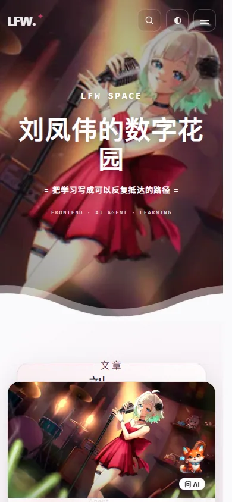
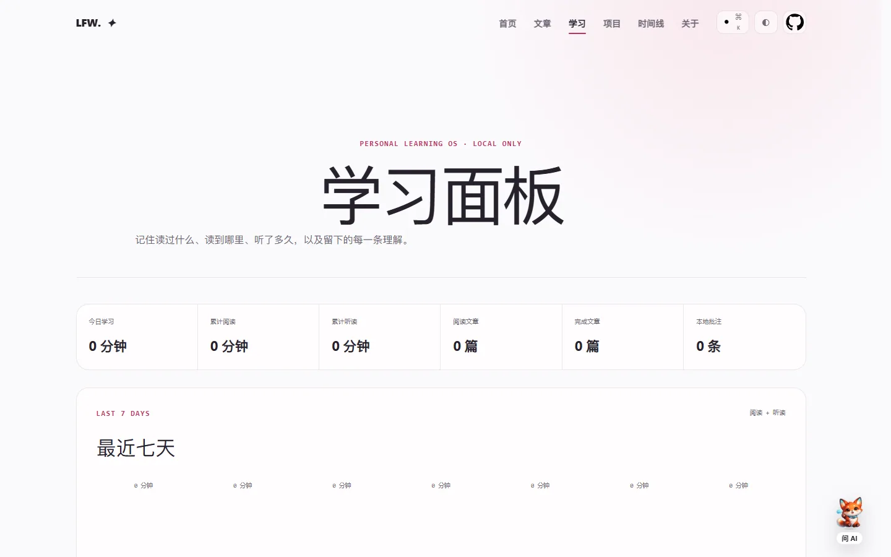
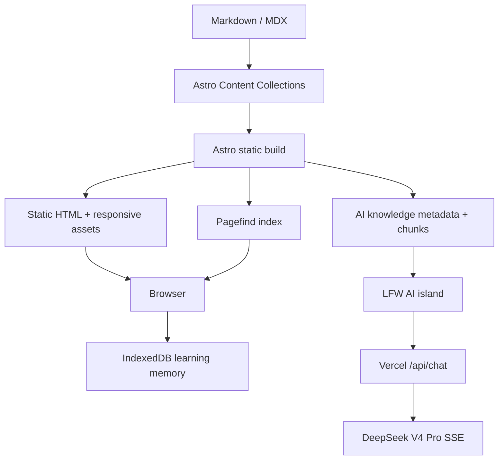

# LFW Space

> AI Native Personal Digital Garden & Learning OS

[Production](https://liufengwei-personal-blog.vercel.app/) · [Architecture](docs/ARCHITECTURE.md) · [Performance](docs/PERFORMANCE.md) · [Release checklist](docs/RELEASE-CHECKLIST.md)

LFW Space 是刘凤伟的个人技术博客、AI 数字花园与本地优先学习系统。内容以 Markdown / MDX 为唯一事实来源，经 Astro 静态生成并由 Pagefind 建立全文索引；需要交互的 AI、检索、阅读记忆和语音能力以局部 Island 或延迟加载模块加入。

**Project status：Maintenance Mode。** 仓库已包含静态站、Learning OS，以及可选的 Node / MySQL / Redis / OAuth / 跨设备同步实现。当前生产默认仍是 Vercel 静态站与 `/api/chat`；仓库存在不等于可选后端已在生产启用。后续只新增文章、修复 Bug、升级依赖和维护已实现能力，不再扩张新的内容系统、社交系统、AI Provider 或数据基础设施。

## Screenshots

| Desktop                                                  | Mobile                                                 |
| -------------------------------------------------------- | ------------------------------------------------------ |
|  |  |

| Article-aware AI                                   | Learning OS                                                |
| -------------------------------------------------- | ---------------------------------------------------------- |
|  |  |

更多：[文章页](docs/images/article.webp)。截图由 `pnpm screenshots:capture` 从生产构建生成。

## Features

- Koharu-inspired original home：沉浸式封面、双层浮动波浪、响应式内容编排，并支持 `prefers-reduced-motion`。
- Astro SSG：文章、分类、标签、系列、项目、时间线、归档、RSS、sitemap 与 404 全部静态输出。
- Zero-friction Markdown：内容脚本自动补齐 Frontmatter，稳定 slug 不依赖文件移动；Content Collections 在构建期校验。
- Pagefind：生产构建后生成无后端全文搜索，搜索 UI 首次交互时加载。
- LFW AI：DeepSeek V4 Pro、SSE Streaming、快速/深度思考、当前文章上下文与划线问 AI。
- AI Retrieval 2.0：Metadata Query、Heading Chunk Retrieval、中英混合词法检索与可追溯站内来源，不依赖向量数据库。
- Personal Learning OS：IndexedDB 阅读/听读时长、进度、已读状态、锚定批注、JSON 导入导出与本地语音播放。
- Production SEO：canonical、Open Graph、Twitter Card、1200×630 分享图、WebSite / Person / BlogPosting / BreadcrumbList JSON-LD、RSS、robots 与 sitemap。
- Quality gates：Node 22、pnpm 10.24、逻辑与集成测试、Playwright 关键流程与响应式矩阵、SEO/Bundle/Secret 检查和 GitHub Actions。

## Architecture



静态内容不为 AI 或学习功能支付全站 hydration 成本。通用脚本只处理导航、主题和 reveal；文章目录、代码工具、图片灯箱、Mermaid、划线与听读只进入文章页。完整边界和数据流见 [docs/ARCHITECTURE.md](docs/ARCHITECTURE.md)。

## Tech stack

- Astro 7、TypeScript 6、React 19 Islands
- Tailwind CSS 4、CSS Variables、Astro Assets / Sharp
- Markdown / MDX、Zod、Shiki、GFM、KaTeX、Mermaid
- Pagefind、Vercel Functions、DeepSeek Anthropic-compatible API、SSE
- 可选全栈：Fastify、MySQL、Drizzle ORM、Redis、Better Auth、Docker
- IndexedDB、Web Speech API
- Node.js 22、pnpm 10.24、Node Test Runner、Playwright、Biome、Prettier

## AI

浏览器只发送共享契约允许的消息、模式、文章上下文和可选划线片段。`src/lib/ai/chat-contract.ts` 使用 Unicode code point 计数和截断，客户端与服务端共享相同限制；`pnpm ai:function:check` 保证生成的 Vercel Function 与源码没有漂移。

当前生产默认的 `/api/chat` 在服务端校验来源、Content-Type、64 KiB 请求体、字段长度、速率与并发，读取服务器环境变量后调用固定的 DeepSeek HTTPS 端点。Key、Base URL、模型和 System Prompt 都不能由浏览器覆盖。仓库另有可选的 Node `/api/v1/ai/chat`，用于 Redis 分布式控制、登录后私有上下文与会话持久化；只有显式配置并完成部署 smoke 后才应切换。CI 的 AI E2E 使用 mocked SSE，真实模型只在发布前人工验证。

Retrieval 2.0 将确定性的分类/标签/系列计数作为结构化事实，将文章按 heading 切块用于技术问题召回。更多说明与本地检查命令见 [docs/AI-RETRIEVAL.md](docs/AI-RETRIEVAL.md)。

## Learning OS

文章阅读、听读、已读状态和批注保存在当前浏览器的 IndexedDB `lfw-learning-db`。这些数据默认不会上传给 AI、Analytics 或第三方；清除站点数据或更换设备仍可能造成丢失，因此学习面板提供 JSON 导出、校验和合并导入。

原文朗读与 AI 精华听读使用浏览器 Web Speech API。Voice、后台播放和锁屏行为取决于设备；项目不伪装生成可下载 MP3，AI 听读稿可下载为文本。

## Content pipeline

最快的写作路径：

1. 将 Markdown 放到 `src/content/blog/<分类>/`。
2. 运行 `pnpm dev`；`content:prepare` 会补齐缺失 Frontmatter 并监听新增文章。
3. 将 `draft` 改为 `false` 后运行 `pnpm content:check`。

也可以通过 CLI 创建：

```bash
pnpm content:new -- --title "文章标题" --category "前端" --tags "Astro,TypeScript" --description "至少十个字符的摘要"
```

常用命令包括 `content:new`、`content:import`、`content:list`、`content:stats`、`content:prepare` 和 `content:check`。内容准备会保留已有元数据、代码块与正文。

## Performance

2026-08-09 的本地 Lighthouse 生产构建结果：Home Mobile 98、Article Mobile 98、Learning Mobile 99；三个桌面页面均为 100。移动 LCP 分别为 2.30 s、2.37 s、2.05 s，CLS 均不超过 0.050，TBT 均为 0 ms。环境、前后对照、传输拆分和 Bundle budget 见 [docs/PERFORMANCE.md](docs/PERFORMANCE.md)。

主要策略：

- 首页、搜索和 AI 的非关键代码延迟到可见或首次交互。
- KaTeX、Mermaid、目录、代码工具和选区能力只进入文章路径。
- Astro 响应式图片声明尺寸，首屏图片按需 eager，其余 lazy。
- Bundle 报告分别限制首页、文章和学习页初始 JS/CSS；大型 Mermaid/Cytoscape chunk 保持动态加载。

## SEO

`SEOHead.astro` 统一生成绝对 canonical、Open Graph、Twitter Card 和真实 1200×630 JPEG。站点页输出 WebSite + Person；文章页追加 BlogPosting 和“首页 → 分类 → 文章”BreadcrumbList。404 明确 `noindex, nofollow`，构建检查会验证全部生成页面、分享图尺寸、RSS、robots 与 sitemap 中不存在 localhost 或 404。

## Development

要求 Node.js 22.12+ 与 pnpm 10.24。常用启动模式如下：

```bash
pnpm install --frozen-lockfile
pnpm dev           # Astro + Content Watch；Key 有效时自动启动/复用本地 AI Gateway
pnpm dev:ai        # 严格本地 AI 模式；缺 Key 或 Gateway 不可用时失败
pnpm dev:fullstack # MySQL + Redis + migration + Fastify :8788 + Astro（需要 Docker）
pnpm ai:doctor     # 安全检查本地配置；加 --probe 执行最小真实 AI 探测
```

`pnpm dev` 在没有 `DEEPSEEK_API_KEY` 时仍会启动 Web，不会让日常写作被 AI 配置阻塞。本地 AI Gateway 使用 `127.0.0.1:8787/api/chat`，并允许 Astro 自动换端口后的 loopback Origin；`ai:doctor` 只输出配置状态，不打印 Secret。

生产预览：

```bash
pnpm build
pnpm preview
```

首次配置 AI 本地联调：

```bash
Copy-Item .env.example .env.local
pnpm dev:ai
```

`pnpm dev:ai` 同时启动 Astro 与复用生产 Handler 的本地 AI Gateway；不会维护第二套上游请求实现。`pnpm dev:fullstack` 是独立的可选云能力联调入口，不代表当前生产默认已经切换到 Node。

## Environment variables

| Variable            | Purpose                                     | Boundary        |
| ------------------- | ------------------------------------------- | --------------- |
| `DEEPSEEK_API_KEY`  | DeepSeek 密钥                               | 仅 Server，必需 |
| `DEEPSEEK_BASE_URL` | 固定为 `https://api.deepseek.com/anthropic` | 仅 Server       |
| `DEEPSEEK_MODEL`    | 固定为 `deepseek-v4-pro`                    | 仅 Server       |
| `SITE_URL`          | canonical / origin allowlist                | Build + Server  |

从 `.env.example` 创建未跟踪的 `.env.local`，将 `replace_me` 换成真实 Key。不要把 Secret 写入源码、文档、测试或 Git 历史。Vercel 环境变量修改后需要重新部署。

## Quality commands

```bash
pnpm quality             # content + tests + typecheck + lint + format + AI bundle drift
pnpm build               # static pages + Pagefind index
pnpm seo:check           # metadata / JSON-LD / social images / RSS / sitemap / robots
pnpm bundle:report       # route-level initial JS/CSS budget
pnpm test:e2e            # mocked AI flows + responsive route audit
pnpm fullstack:check     # optional Node/API unit and configuration gates
pnpm test:integration    # real MySQL/Redis integration gate when services are available
pnpm docker:smoke        # optional container build/start/readiness smoke
pnpm secret:scan         # tracked-file secret scan
pnpm release:check       # complete sequential release gate
pnpm screenshots:capture # regenerate compressed README screenshots from dist
```

## Deployment and release

当前生产默认由 Vercel 使用 `pnpm install --frozen-lockfile`、`pnpm build` 和 `dist` 输出。公开站点仍为静态部署；只有 `/api/chat` 与 `/api/ai-health` 是默认 Serverless Functions。可选 Fastify 服务及其 MySQL/Redis 依赖已在仓库实现并由 CI 验证，但生产启用状态必须由部署证据单独确认。`vercel.json` 设置 HSTS、CSP、MIME sniffing、frame、referrer、permissions、COOP 与不可变构建资源缓存头。

推荐发布流程：release branch → Pull Request → GitHub Actions green → merge main → wait for Vercel production → browser/AI smoke → annotated tag → GitHub Release。逐项清单见 [docs/RELEASE-CHECKLIST.md](docs/RELEASE-CHECKLIST.md)。

## Maintenance Mode

v2.0 已完成内容发现、文章阅读、系列学习、Learning OS、LFW AI 与跨设备学习基础设施。后续工作限定为新增文章、Bug 修复、依赖升级和线上维护；不会为了扩大项目体量引入 Vector DB、评论、点赞、复杂社交、更多 AI Provider 或新的后台系统。

## License and assets

本仓库当前没有 LICENSE，代码许可仍由项目所有者决定。不要据此推定开源授权。图片来源、所有者提交记录与 astro-koharu 视觉参考见 [docs/ASSET-SOURCES.md](docs/ASSET-SOURCES.md)。
