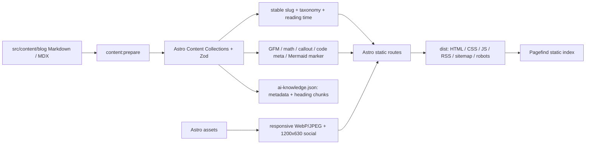
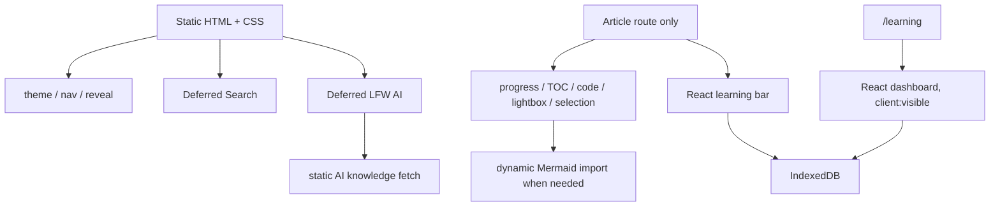
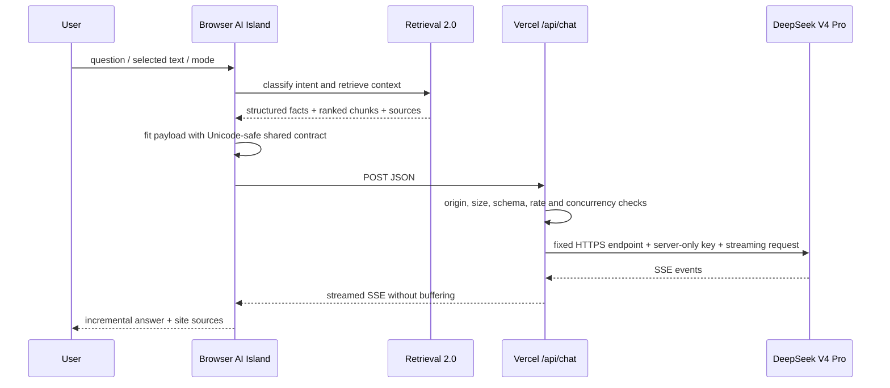
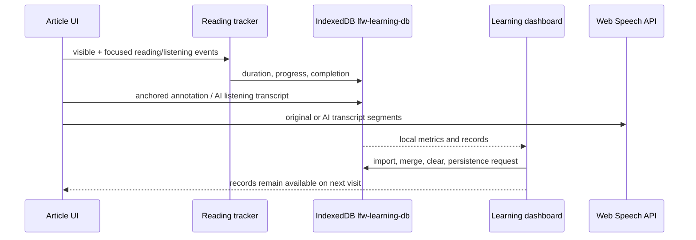

# LFW Space v1.0 Architecture

本文描述 v1.0.0 的真实代码边界。核心原则是“静态内容默认零运行时服务，交互能力局部增强，私密学习数据本地优先，模型密钥只存在服务端”。

## 1. System boundary

LFW Space 由三个运行环境组成：

1. **Build time**：Astro Content Collections 读取 Markdown / MDX，完成 schema、slug、Markdown AST、图片、页面、Pagefind 与 AI knowledge 产物。
2. **Browser runtime**：静态 HTML/CSS 为基础；React Islands 和原生模块只负责搜索、AI、学习、目录、选区、听读等交互。
3. **Serverless runtime**：Vercel `/api/chat` 和 `/api/ai-health`。前者作为 DeepSeek 流式代理，后者只报告配置状态，不泄露 Secret。

没有独立 Node 服务、数据库、Redis、账号、评论或批注同步。

## 2. Build-time architecture

### Content Collections and stable slug

`src/content.config.ts` 定义文章数据契约；构建只包含非草稿文章。`scripts/content` 可以补齐缺失 Frontmatter，但不会覆盖已有元数据、代码或正文。URL slug 由标准化逻辑稳定生成，文章在分类目录间移动不会无意改变公开路径。

### Markdown pipeline

- remark-gfm：表格、任务列表等 GFM。
- remark-math + rehype-katex：数学语法；KaTeX CSS 只由文章增强入口加载。
- remark-callouts：语义化提示块。
- remark-code-meta：代码标题和元数据。
- remark-mermaid：构建期标记 Mermaid 源码；渲染库在含图文章的浏览器端动态导入。
- rehype-slug + autolink headings：稳定目录锚点。

### Generated artifacts

`dist`、Pagefind 索引、Astro 类型和 `api/chat.mjs` 都是可再生输出。`content:prepare` 和 `build` 前后的 `git diff --exit-code` 防止生成步骤悄悄修改源码；`ai:function:check` 校验已提交 Function bundle 与共享源码一致。

## 3. Browser runtime

### Island boundaries

- `DeferredSearch.astro`：只在首次打开搜索时加载搜索 UI 和 Pagefind。
- `DeferredAIAssistant.astro`：首屏只输出轻量宠物触发器；点击、键盘或划线问 AI 时加载完整 React 面板。
- `ArticleLearningBar.tsx`：文章页读取与更新当前文章的本地学习状态。
- `LearningDashboard.tsx`：学习页在可见时 hydration；服务端先输出稳定骨架以避免布局偏移。
- `ContinueLearning.tsx`：首页下方可见时 hydration。

文章正文、文章卡片、分类、标签、项目和关于页面不依赖 React 才能阅读。

### Page-specific enhancement split

`BaseLayout.astro` 只保留全局 reveal。`ArticleEnhancements.astro` 和 `article-enhancements.ts` 仅在文章路由执行阅读进度、目录、代码复制、图片灯箱、Mermaid、选择工具与语音控制。这样首页、项目、关于和分类页不会下载文章专属逻辑或 KaTeX 样式。

## 4. AI request flow

### Shared chat contract

`src/lib/ai/chat-contract.ts` 是客户端、Vercel Handler 和测试的共同请求契约。所有字符串限制按 Unicode code point 计算，不会从 surrogate pair 中间截断 emoji。它限制消息数、单条/总消息内容、当前页面、检索上下文、划线片段和批注长度，并在发送前按同一规则压缩 payload。

### Vercel Function boundary

Handler 只接受 JSON POST：

- 校验同源 / 配置域名、Content-Type 与 64 KiB 请求体。
- Zod 解析共享字段；无效 JSON、契约错误、超限分别返回稳定错误码。
- 固定 `api.deepseek.com/anthropic` 与 `deepseek-v4-pro`，浏览器不能注入模型、Base URL 或 System Prompt。
- Key 只从 Vercel 环境变量读取；日志移除可能的 Key 片段。
- 实例内速率限制、最大并发、55 s 上游超时和断开传播用于控制滥用与资源占用。
- 成功响应保持 `text/event-stream`、`no-store` 与禁用代理缓冲。

实例内限流不等于全局配额；流量增长后应由 Vercel Firewall 或外部共享限流承担全局策略。

## 5. Retrieval 2.0

AI knowledge 由公开 Content Collections 构建，分为：

- **Metadata Query**：分类、标签、系列、文章数量和完整列表属于确定性事实，检索层生成结构化答案上下文，避免让模型猜数字。
- **Chunk Retrieval**：文章按 heading 拆分，保存标题、分类、URL、heading 和 excerpt；问题只带排名靠前的片段进入模型。
- **Mixed-language lexical search**：`Intl.Segmenter`、中文 bigram fallback、英文归一化和小型同义词表共同处理中文、英文与混合查询。
- **Source traceability**：召回项保留真实站内 URL，UI 展示来源。

v1.0 不使用向量数据库，因为 52 篇公开文章可在构建期生成小型静态知识集，确定性元数据与词法召回更简单、可检查、无额外隐私/运维成本。未来可在保持 request/context contract 不变的前提下加入 embedding + lexical hybrid rerank。

## 6. Learning data flow

### IndexedDB model and privacy

IndexedDB 保存文章记录、批注、听读稿缓存与偏好。阅读计时只在页面可见、窗口聚焦且达到有效交互条件时累积，降低把后台挂机误算为学习的概率。批注用文章 slug、文本上下文和锚点定位；内容变化后可通过上下文恢复，但不是跨版本绝对稳定的 CRDT。

数据默认 Local Only。AI 只有在用户主动提问、选择文字或生成听读稿时才收到明确构建的上下文；学习数据库不会被批量上传。JSON 备份在导入前校验版本和结构。

### Speech

`speechSynthesis` 分段播放原文或 AI 听读稿，语音列表、速率和进度在客户端管理。该 API 不产生可靠的音频 Blob，因此 v1.0 不承诺 MP3、后台持续播放或跨设备一致 Voice。

## 7. Search and query behavior

Pagefind 在 `astro build` 后扫描 `dist`，只索引带 `data-pagefind-body` 的公开页面。搜索无需服务端和数据库，静态索引由 CDN 缓存。AI Retrieval 与 Pagefind 使用不同产物：前者面向结构化 AI 上下文，后者面向用户全文导航，两者都来源于同一公开内容集合。

## 8. SEO and discoverability

`SEOHead.astro` 从单一站点配置生成绝对 canonical、社交元信息、RSS link 和 JSON-LD。Astro Assets 在构建期从真实封面裁剪 1200×630 JPEG。站点页包含 WebSite / Person；文章页包含 BlogPosting / BreadcrumbList；404 使用 `noindex, nofollow`。Astro sitemap 排除 404，RSS、robots 和 sitemap 均指向生产 origin。

## 9. Performance model

性能预算按路由初始依赖而非所有动态 chunk 计算：

- Home：初始 JS + CSS gzip ≤ 35 KiB。
- Article：初始 JS + CSS gzip ≤ 45 KiB。
- Learning：初始 JS + CSS gzip ≤ 35 KiB。

Mermaid/Cytoscape、KaTeX 和完整 AI 面板具有价值但不应成为所有页面的首屏成本。大型 Mermaid chunk 的构建 warning 被保留用于可见性；它通过动态 import 与普通路由隔离，不能简单通过删除功能或调高 warning 假装解决。

## 10. Deployment and security

GitHub Actions 使用 Node 22、pnpm 10.24、frozen lockfile 和 Playwright Chromium，顺序执行内容、测试、类型、lint、格式、AI bundle、build、bundle、SEO 与 E2E。CI 不读取真实 AI Secret。

Vercel 部署 `dist` 并运行根目录 Functions。`vercel.json` 配置 HSTS、CSP、`nosniff`、frame deny、referrer policy、permissions policy、COOP 和 `/_astro` immutable cache。CSP 保留 Astro 当前内联初始化所需的 `unsafe-inline`，并在实际页面回归中验证 AI、Pagefind 与 Islands。

## 11. Future Node / MySQL / Redis boundary

只有出现跨设备账号、同步学习数据、多人评论、严格全局配额或管理后台时，才引入持久后端：

- Node API：认证、同步协议、权限、后台任务。
- MySQL/PostgreSQL：用户、文章业务状态、批注同步与审计记录；Markdown 仍保留在 Git，避免把写作源迁进数据库。
- Redis：全局限流、短期缓存、队列协调，不作为真实业务数据唯一来源。
- Retrieval：向量索引作为可再生派生产物，Metadata Query 继续走确定性数据库/构建事实。

该演进应保持静态阅读路径可用，让后端故障不会使公开文章不可访问。
