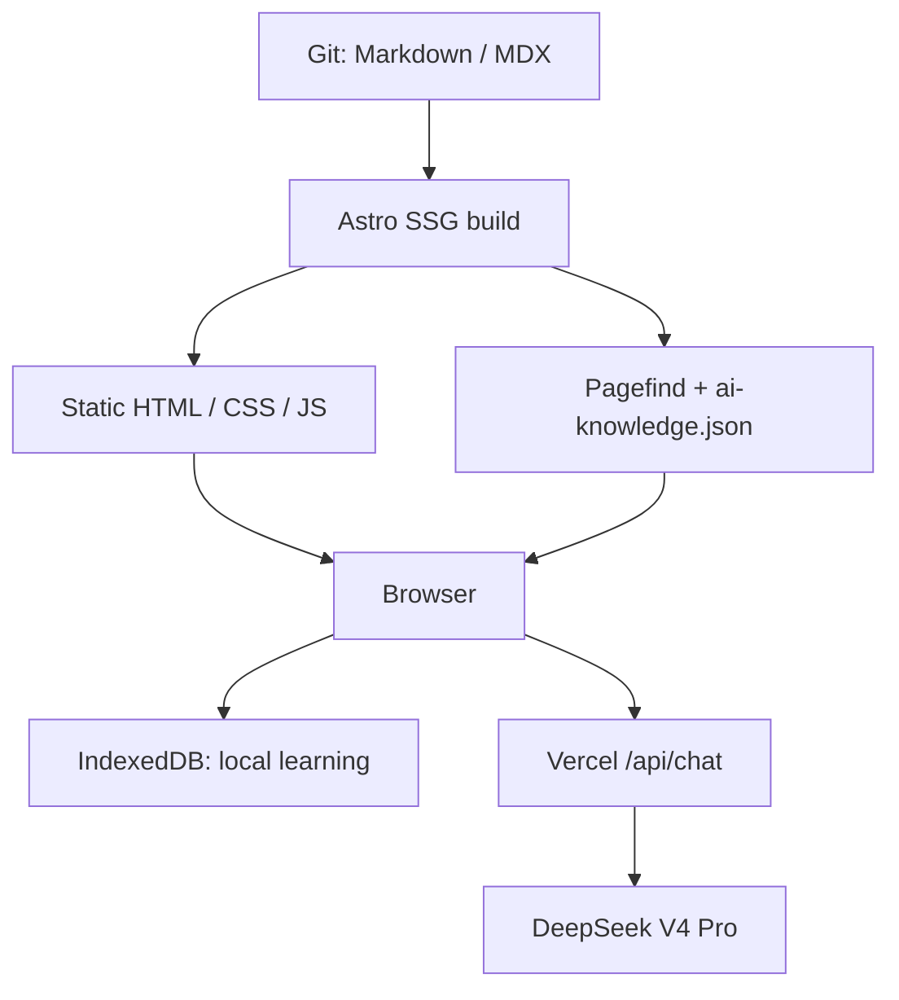
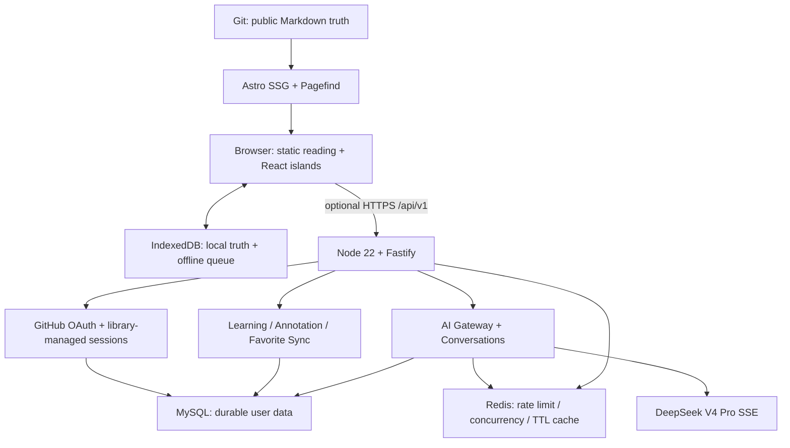

# LFW Space v2.0 Full-Stack AI Learning Cloud

> Status: Repository implementation complete and CI-verified as an optional deployment path; production enablement is not asserted
>
> Date: 2026-08-10
>
> Implementation: API, data, auth, sync, Redis controls, Node AI gateway, and deferred Web integration are implemented

## 1. Objective

LFW Space v2.0 在现有 Astro 静态博客外增加可选的 Node.js、MySQL、Redis、GitHub
OAuth、跨设备学习同步与持久化 AI 能力。静态公开知识与动态私有数据必须保持清晰边界：

- Markdown / MDX 继续由 Git 管理并在构建时生成静态页面。
- IndexedDB 继续承担匿名模式与故障模式下的本地学习能力。
- MySQL 只保存账号、学习、收藏、同步操作和 AI 会话等动态用户数据。
- Redis 只解决跨 Node 实例的短期协调问题，不保存不可恢复的事实。
- Node、MySQL、Redis 或 AI 全部不可用时，公开文章仍可读。

## 2. Audit result

### Repository facts

- Astro Web 保持在仓库根目录；`pnpm-workspace.yaml` 管理 root、`server/` 与 `packages/contracts/`。
- Astro 7.1.6 static output、React 19.2.8、Node `>=22.12.0`、pnpm 10.24.0。
- Web 构建生成静态页面、Pagefind、RSS、sitemap、OG 与静态 AI knowledge index；检查不依赖固定页面数量。
- 浏览器保留 IndexedDB 本地能力，并实现 versioned migration、offline mutation queue 与可选云同步。
- Vercel `/api/chat` 是当前生产默认；Fastify `/api/v1/ai/chat`、MySQL 持久化与 Redis 分布式控制是可选部署路径。
- CI 的单一 Ubuntu `release-gate` 顺序覆盖 Web/API 质量、MySQL/Redis 集成、Docker 与浏览器检查；外部 OAuth 和 AI Provider 使用 mock。
- 文章初始 JS + CSS 预算为 45 KiB gzip，由 `pnpm bundle:report` 验证。

### Documentation conflict

早期 `docs/V2-SPEC.md` 将 Node、MySQL、Redis、认证列为 non-goals；旧 Roadmap 又将它们
拆为 V3–V6。两者已被本文件取代，但保留为历史记录，不冒充已实现能力。

## 3. Current production-default architecture



当前生产默认的数据真相边界：公开内容属于 Git；未启用云端配置时私有学习只在当前浏览器；AI 会话不持久化；Vercel Function 的 rate limit 与 active stream counter 不能跨实例共享。

## 4. Implemented optional full-stack architecture



Public reading never traverses the Node API. Cloud features are feature-detected and deferred.

## 5. Repository layout

The existing Astro root stays in place to avoid a large rename diff.

```text
/
├─ src/                         # existing Astro application
├─ public/
├─ api/                         # existing Vercel AI adapter, retained during migration
├─ server/
│  ├─ src/
│  │  ├─ app.ts                # app factory; no listen side effect
│  │  ├─ server.ts             # bootstrap and graceful shutdown
│  │  ├─ config/
│  │  ├─ plugins/
│  │  ├─ modules/
│  │  └─ db/
│  ├─ migrations/              # committed SQL
│  ├─ tests/
│  ├─ Dockerfile
│  └─ package.json
├─ packages/
│  └─ contracts/               # Zod schemas and browser/server types
├─ compose.yaml                # local MySQL + Redis only
└─ pnpm-workspace.yaml
```

The root remains the Web package. `server` may depend on `packages/contracts`; browser bundles must
not import server-only modules or Node drivers.

## 6. Verified dependency direction

No dependency is added by this architecture commit. Registry metadata and official docs were checked
on 2026-08-10:

| Area         | Verified candidate                               | Decision                                                                                      |
| ------------ | ------------------------------------------------ | --------------------------------------------------------------------------------------------- |
| HTTP         | Fastify 5.11.3                                   | Adopt; v5 supports Node 20+, so the repository's Node 22 floor is compatible.                 |
| HTTP plugins | `@fastify/cors` 11.3.0, `@fastify/helmet` 13.1.0 | Adopt only in the API package.                                                                |
| ORM          | Drizzle ORM 0.45.2 + drizzle-kit 0.31.10         | Adopt code-first schema plus committed SQL migrations.                                        |
| Driver       | mysql2 3.23.2                                    | Adopt a managed promise pool; use a single connection for DDL migration execution.            |
| Redis        | node-redis (`redis`) 6.2.0                       | Adopt one managed client with reconnect backoff and graceful close.                           |
| Auth         | Better Auth 1.6.26 + Drizzle adapter 1.6.26      | Adopt after schema-generation review; official Fastify, GitHub and MySQL/Drizzle paths exist. |

Fastify is preferred over NestJS because the boundary is a focused API/SSE service and Fastify already
provides schema validation, serialization, request IDs, Pino logging, plugins and `inject()` testing.
There is no demonstrated need for a module/DI framework with a much larger file surface.

## 7. API foundation

The app factory must be independently injectable and contain:

- strict environment parsing with placeholders rejected in production;
- server-generated request IDs (never trust an unvalidated client request-id);
- structured Pino logs with redaction for authorization, cookies, OAuth/API secrets, DB/Redis URLs;
- exact-origin credentialed CORS, security headers, conservative body limits and a uniform error handler;
- one MySQL pool and one managed Redis client per process, both closed during graceful shutdown;
- no request body or AI conversation content in general logs.

Endpoints begin under `/api/v1` except health:

- `GET /health/live`: proves the Node process/event loop can answer; no external probe.
- `GET /health/ready`: bounded MySQL and Redis pings; returns only component state and request ID,
  never hosts, credentials, URLs or keys.

Errors use:

```json
{
  "error": {
    "code": "VALIDATION_ERROR",
    "message": "Request fields are invalid",
    "requestId": "..."
  }
}
```

Production responses never include stack traces or raw SQL/provider errors.

## 8. Environment and feature flags

Tracked `.env.example` contains placeholders only. The API contract includes `NODE_ENV`, `API_PORT`,
`API_ORIGIN`, `DATABASE_URL`, `REDIS_URL`, `WEB_ORIGIN`, GitHub credentials, session secret and
DeepSeek settings. `API_ORIGIN` is the path-free public API origin; the GitHub OAuth callback is
`${API_ORIGIN}/api/auth/callback/github`.

The browser uses a build-time `PUBLIC_CLOUD_API_URL` gate:

- absent: no auth/sync client is loaded and current local-only behavior remains;
- present but unhealthy: static reading and IndexedDB remain available, UI reports cloud offline;
- present and healthy: account and sync islands activate;
- AI continues using `/api/chat` until the Node AI deployment passes its own smoke gate.

No production default changes merely because this branch is merged.

## 9. Durable data model

Markdown is deliberately absent from the database.

### Authentication-owned tables

Better Auth's generated Drizzle schema is the source for `users`, `sessions`, `oauth_accounts` and
verification/state tables. Generated migrations are reviewed before commit; experimental joins are
not enabled initially. Sessions stay database-backed so Redis is not an authentication truth source.

### Product tables

| Table                       | Purpose                                                    | Required uniqueness / indexes                                                  |
| --------------------------- | ---------------------------------------------------------- | ------------------------------------------------------------------------------ |
| `learning_progress_devices` | Absolute counters and resume state per user/article/device | unique `(user_id, article_slug, device_id)`; index `(user_id, article_slug)`   |
| `annotations`               | TextQuote anchors, note, version and tombstone             | index `(user_id, article_slug, updated_at)`; unique `(user_id, annotation_id)` |
| `favorites`                 | Local/cloud article favorites                              | unique `(user_id, article_slug)`                                               |
| `sync_operations`           | Idempotency ledger for accepted mutations                  | unique `(user_id, operation_id)`; retention index on `created_at`              |
| `user_preferences`          | Explicit privacy and learning preferences                  | unique `(user_id, preference_key)`                                             |
| `ai_conversations`          | Opt-in durable conversation metadata                       | index `(user_id, updated_at)`                                                  |
| `ai_messages`               | Conversation role/content/mode and bounded source metadata | index `(conversation_id, created_at)`                                          |

Foreign keys use explicit delete behavior. Account deletion runs one reviewed transaction/cascade
policy and revokes sessions; it must not leave cross-user rows. SQL is emitted by Drizzle or uses
parameterized driver APIs—never string concatenation.

## 10. Local-first sync protocol

### IndexedDB migration

Upgrade `lfw-learning-db` with `onupgradeneeded`; never call `deleteDatabase()` or `clearAll()` during
migration. Preserve all v1 stores and add versioned stores such as `syncQueue`, `syncMeta`,
`cloudProgress` and local favorites. Migration tests start from a populated v1 database and prove
progress, annotations, audio scripts and settings survive.

`deviceId` is a random UUID stored in IndexedDB settings. It is not a browser fingerprint and never
uses canvas, IP, MAC or hardware-derived identity.

### Mutation envelope

```ts
interface SyncOperation {
  operationId: string;
  deviceId: string;
  entityType: 'progress' | 'annotation' | 'favorite';
  entityId: string;
  operation: 'upsert' | 'delete';
  payload: unknown;
  createdAt: string;
}
```

The browser writes locally first, then queues an operation. A bounded batch is retried with
exponential backoff plus jitter. `navigator.onLine` is only a hint; a successful response proves
recovery. The server records `(user_id, operation_id)` in the same transaction as the mutation, so
ten retries apply once.

### Progress merge

Each device uploads absolute, monotonic counters—never the cloud aggregate. Server upsert rules:

- per-device `read_seconds` / `listen_seconds`: monotonic maximum;
- `max_progress`: maximum;
- `completed_at`: earliest non-null completion;
- resume heading/progress/scroll: value from the device record with the newest accepted activity;
- aggregate time: sum across device rows; aggregate max progress: maximum across device rows.

The cloud aggregate is returned separately and is never copied into a device counter, preventing
double counting.

### Annotation and favorite conflicts

Annotation UUID/TextQuote fields remain compatible with v1. Deletes create a tombstone (`deleted_at`)
so an offline device cannot resurrect a deleted row. Conflicts use documented last-write-wins over a
server-issued version/normalized timestamp; stale mutations receive the authoritative record instead
of silently overwriting it. Favorites use the same idempotent upsert/tombstone envelope.

## 11. Authentication and request security

- GitHub is the only first login provider in this phase.
- Better Auth owns OAuth state, callbacks, session rotation and logout invalidation.
- Sessions are library-managed, database-backed and sent only in HttpOnly cookies; production cookies
  are Secure with an explicit SameSite policy. Session tokens never enter localStorage.
- `trustedOrigins` and Fastify CORS use the exact Web origin with credentials; production does not use
  wildcard origins.
- Every cookie-authenticated mutation validates Origin/Fetch Metadata as appropriate in addition to
  SameSite protections. SameSite alone is not treated as a complete CSRF defense.
- CI uses a test-only authentication adapter. A dev-login route cannot compile/register unless
  `NODE_ENV=test`.
- Anonymous users retain every public route, Pagefind, local learning, annotations, listening and the
  existing AI path without being forced to sign in.

## 12. Redis role and failure policy

Redis solves only cross-instance ephemeral coordination:

1. distributed AI rate limit by authenticated user or hashed client address;
2. user/global AI concurrency leases with unique owner tokens and TTL;
3. bounded short-TTL caches for derived public retrieval or learning summaries.

Rate/concurrency acquisition and release must be atomic (transaction or reviewed Lua/function). A
lease has a TTL and release verifies ownership. Redis keys contain opaque IDs, never raw prompts,
cookies, tokens or annotations.

Failure policy:

- AI rate limit/concurrency fails closed with a safe retryable 503 because bypassing a global cost and
  abuse control is security-sensitive;
- cache misses or Redis cache outage recompute from the durable source;
- auth and learning writes continue against MySQL when Redis is unavailable;
- readiness reports Redis unavailable, while liveness remains healthy.

Redis is never a source for sessions, learning, annotations, favorites or conversations.

## 13. AI strangler migration

The browser payload in `chat-contract.ts`, Fast/Deep semantics, Selection Ask, Current Article,
Listening, Retrieval 2.0 and SSE remain compatible.

1. Extract shared Zod contracts/provider-independent core into `packages/contracts` only when tests
   prove the browser payload is unchanged.
2. Add `POST /api/v1/ai/chat` in Fastify with server-owned model/provider/base URL/key/prompt.
3. Mock DeepSeek in CI; never use a real secret.
4. Keep Vercel `/api/chat` until the Dockerized Node endpoint is deployed and smoke-tested.
5. Switch the frontend endpoint through explicit configuration, with `/api/chat` as fallback.

Logged-in users may opt into durable conversations. Private learning context is off by default and
requires an explicit per-request/UI scope. When on, retrieval sends only question-relevant, bounded
annotations/progress/favorites; it never dumps full learning history. Markdown, selections and user
notes are untrusted data, not system instructions. No vector database is introduced without measured
need beyond the current 52-article retrieval corpus.

## 14. Performance and UX constraints

- Account, sync and cloud clients are deferred islands; static pages do not hydrate globally.
- Article initial JS + CSS stays `<=45 KiB gzip` or requires a measured, approved exception.
- Existing Home, article, code, TOC, cover and wave design are out of scope for redesign.
- `/learning` adds compact Local/Syncing/Synced/Offline/Error state, last sync and conflict recovery;
  it does not become an admin dashboard.
- Login/account/sync controls support keyboard navigation, focus management, Escape, names and reduced
  motion.
- This phase does not add a service worker or full PWA.

## 15. Testing and CI gates

Each slice ends in tests, review and an atomic commit.

- Unit: merge rules, idempotency, annotation conflicts, rate limit, AI privacy policy, auth guards.
- API: Fastify `inject()` for validation, errors, liveness/readiness, auth and SSE adapters.
- Integration: real MySQL and Redis services, fresh/existing migrations, repositories and atomic Redis
  behavior.
- Security: unauthorized/cross-user access, invalid UUID, oversized/malformed input, injection strings,
  Origin/CSRF, expired sessions, tombstones and prompt boundaries.
- E2E: anonymous/local behavior; mocked login; Device A/B sync; offline replay without duplicates;
  logout isolation; AI private context off/on; Redis 429.

CI 的单一 `release-gate` job 顺序执行 Web Quality、API Quality、Full-stack Integration、Docker 与 E2E 门禁。`pnpm release:check` 仍是 Web 发布的完整串行检查；GitHub OAuth 和 DeepSeek 在 CI 中始终使用 mock。

## 16. Deployment truth

- Web remains Vercel static deployment.
- API 已提供 multi-stage、non-root Docker image、healthcheck 和 graceful shutdown；这描述交付物，不声明生产已部署。
- Local `docker compose` runs official MySQL and Redis images with healthchecks; the API may run via
  pnpm on the host.
- Production migration is an explicit command/job, never destructive schema creation at API startup.
- Without user-provided cloud credentials, the deliverable is Docker/contract/migration/deployment
  ready but is not described as a live backend.
- No merge to `main`, production default change or v2 tag is performed automatically.

## 17. Completed delivery sequence

1. Workspace + contracts boundary + Fastify config/app factory/live/ready tests.
2. MySQL pool, Drizzle schema, reviewed migrations and repository integration tests.
3. Better Auth GitHub OAuth, secure sessions and auth/security tests.
4. IndexedDB v2 migration, offline queue and sync protocol end to end.
5. Redis distributed controls and Node AI gateway strangler path.
6. Deferred account/sync/privacy UI and browser regression.
7. Full CI, Docker, docs, audit and final report.

A slice cannot start by weakening the previous slice's tests.

## 18. Official implementation sources

- [Fastify v5 migration / Node support](https://fastify.dev/docs/v5.0.x/Guides/Migration-Guide-V5/)
- [Fastify server options, request IDs and body limits](https://fastify.dev/docs/latest/Reference/Server/)
- [Fastify validation and response serialization](https://fastify.dev/docs/latest/Reference/Validation-and-Serialization/)
- [Fastify logging and redaction](https://fastify.dev/docs/latest/Reference/Logging/)
- [Drizzle MySQL with mysql2](https://orm.drizzle.team/docs/mysql/get-started-mysql)
- [Drizzle migration fundamentals](https://orm.drizzle.team/docs/migrations)
- [Better Auth Fastify integration](https://better-auth.com/docs/integrations/fastify)
- [Better Auth Drizzle adapter](https://better-auth.com/docs/adapters/drizzle)
- [Better Auth GitHub provider](https://better-auth.com/docs/authentication/github)
- [Better Auth session management](https://better-auth.com/docs/concepts/session-management)
- [Better Auth cookie and reverse-proxy guidance](https://better-auth.com/docs/concepts/cookies)
- [Better Auth security model](https://better-auth.com/docs/reference/security)
- [node-redis connection and reconnect behavior](https://redis.io/docs/latest/develop/clients/nodejs/connect/)

## 19. Explicit non-goals

- No Astro-to-`apps/web` migration.
- No Markdown/MySQL CMS migration.
- No hand-written OAuth crypto, password hashing or localStorage JWTs.
- No Redis-as-database design.
- No immediate Vercel AI removal or unverified production switch.
- No vector database, email/password auth, public social system, full PWA or observability suite.
- No invented production metrics, traffic, users, hit rates or deployment claims.
