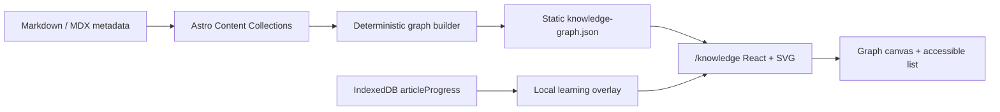

# Knowledge Graph V1 架构

本文面向维护 LFW Space 的前端工程师和技术面试评审者，说明知识图谱的数据来源、构建链路、浏览器交互与隐私边界。读者读完后应能解释图谱为何无需后端、如何验证确定性，以及学习状态如何在不上传的前提下叠加到公开图谱。

V1 只解决公开内容关系浏览和本地学习状态可视化。本文不设计语义相似度、Embedding、Graph RAG、跨设备图谱或新的学习数据库结构。

## 1. 关键结论

LFW Space 在构建期从 Astro Content Collections 生成图谱，并把结果输出为静态 `/knowledge-graph.json`。浏览器在 `/knowledge` 加载 JSON 后，以 React + SVG 提供搜索、筛选、平移、缩放和节点详情；无障碍列表提供等价的键盘导航。

公开图谱与私人学习状态拥有不同事实源。Markdown / MDX metadata 是公开关系的唯一事实源；IndexedDB `lfw-learning-db` 是当前设备学习状态的事实源。浏览器只读现有 `articleProgress` store，并按文章 slug 合并两类数据，不新增 store、表或同步请求。



## 2. 数据来源与权威边界

图谱只消费已有事实，不维护第二份人工图数据：

| 数据                   | 权威来源                          | 作用域           | 写入方                  | 读取失败后的行为                 |
| ---------------------- | --------------------------------- | ---------------- | ----------------------- | -------------------------------- |
| 文章、分类、标签、系列 | `src/content/blog` Frontmatter    | 公开、全站       | Git 中的 Markdown / MDX | 构建失败，阻止发布无效图谱       |
| 图谱 JSON              | Content Collections 的构建产物    | 公开、可再生     | Astro 静态路由          | 页面显示错误态，文章导航保持可用 |
| 阅读进度与完成状态     | IndexedDB `articleProgress`       | 私有、当前浏览器 | 既有 Learning OS        | 仅隐藏学习叠加，公开图谱继续可用 |
| 批注数量               | `ArticleProgress.annotationCount` | 私有、当前浏览器 | 既有 Learning OS        | 不显示批注标记，不影响节点关系   |

`knowledge-graph.json` 是派生产物，不提交为长期事实源。每次构建都重新读取 Content Collections，因此内容作者只需维护 Frontmatter。

## 3. Node 与 Edge 模型

V1 包含 4 类节点：

| Node type  | 稳定 ID                    | 主要字段                               | 导航目标              |
| ---------- | -------------------------- | -------------------------------------- | --------------------- |
| `article`  | `article:<slug>`           | 标题、slug、描述、分类、标签、系列顺序 | `/blog/<slug>`        |
| `category` | `category:<encoded-label>` | 分类名                                 | `/categories/<label>` |
| `tag`      | `tag:<encoded-label>`      | 标签名                                 | `/tags/<label>`       |
| `series`   | `series:<encoded-label>`   | 系列名                                 | `/series/<label>`     |

V1 生成 3 类确定性关系：

- `category`：Article → Category。
- `tag`：Article → Tag。
- `series`：Article → Series。

类型系统预留 `related`，但 V1 不凭标题相似度或 AI 推断文章关系。只有未来从 Markdown AST 提取并校验真实站内文章链接后，Builder 才能生成 Article → Article 的 `related` edge。

## 4. 构建与校验链路

`src/pages/knowledge-graph.json.ts` 在 Astro build 中读取 `blog` collection，并把标准化后的 metadata 交给 `src/lib/knowledge/graph.ts`。静态路由返回版本化 JSON 和 `must-revalidate` 缓存策略。

Builder 在输出前执行以下规则：

- 排除 `draft: true` 的文章。
- 拒绝重复文章 slug、非法 slug 和空 label。
- 要求系列文章提供正整数 `seriesOrder`，并拒绝没有系列名的顺序字段。
- 用 Map 去重 taxonomy node 和 edge。
- 按固定 node type、edge type 和稳定 ID 排序。

Builder 不使用时间戳、进程状态或 `Math.random()`。相同内容即使输入顺序不同，也会输出完全相同的 node、edge 和顺序；单元测试覆盖反向输入、草稿排除、重复处理和系列规则。

## 5. 页面交互与无障碍

`/knowledge` 使用确定性的分类聚类布局。系列位于内环，标签位于外环，文章围绕所属分类排列。SVG canvas 是指针用户的增强体验，支持 hover、点击、pan、zoom、搜索高亮、类型筛选、重置和一度关系聚焦。

页面同时渲染按节点类型分组的 Explore List。列表中的真实 button 和 link 支持键盘选择、详情关联与直接导航，因此图谱不是唯一入口。移动端把工作区改为单列，并在图谱下方展示类似 Bottom Sheet 的节点详情；统计区域、筛选按钮和列表同样按窄屏重排。

当用户启用 `prefers-reduced-motion: reduce` 时，页面关闭节点、边和加载指示器的不必要动画。数据加载失败时，页面显示“知识图谱暂时无法加载”和博客入口，不会白屏。

## 6. Learning OS Overlay

公开图谱加载成功后，页面动态导入现有 Learning repository，并通过 `getLearningDatabase().getAll('articleProgress')` 读取记录。`buildLearningOverlay` 只保留公开图谱中存在的 article slug，避免把草稿或历史残留记录带入 UI。

状态映射复用现有字段：

| 状态          | 判断                                                   |
| ------------- | ------------------------------------------------------ |
| `completed`   | `completedAt` 存在                                     |
| `reading`     | `readSeconds`、`listenSeconds` 或 `maxProgress` 大于 0 |
| `not-started` | 其余公开文章                                           |

Overlay 同时读取 `maxProgress` 和 `annotationCount`。页面只用这些字段展示轻量视觉区别与本地统计，不修改 IndexedDB schema，也不把“批注多”解释为学习能力弱。

## 7. Privacy 与故障隔离

Learning Overlay 完全在浏览器内计算。图谱页面不会把阅读时长、进度、完成状态或批注数量发送给 AI、Analytics、Vercel Function 或其他后端。

两条链路彼此隔离：

- IndexedDB 不可用时，页面显示公开 node 和 edge，并提示本机学习数据暂不可用。
- 静态 JSON 不可用时，页面保留 Header、Footer 和博客入口。
- 可选 Node / MySQL / Redis 服务离线时，公开图谱与本地 Overlay 都不受影响。

## 8. Performance 与 route isolation

Astro 只在 `/knowledge` 输出 Knowledge Graph React island 和页面 CSS。其他页面不引用 `KnowledgeGraphExperience`，因此首页、文章页和学习页不会把图谱交互代码加入初始资源。

Learning repository 使用动态 import。浏览器先完成公开图谱渲染，再读取 IndexedDB；本地数据失败不会阻塞公共数据。图谱未引入第三方可视化框架，当前实现复用 React 并使用原生 SVG，从源头控制依赖与维护成本。

`pnpm bundle:report` 在生产构建后报告各路由的初始 JS/CSS，并单独检查知识页预算和图谱 chunk 不进入 Home、Article、Learning。文章页仍遵守 45 KiB gzip 初始预算。

## 9. 为什么不用 Neo4j 或 Vector DB

当前公开知识规模是几十篇 Markdown，关系在构建时已经由分类、标签和系列 metadata 明确给出。Neo4j 会引入部署、连接、备份、权限和运行时可用性成本，却不会提高这些确定性关系的正确性。

Vector DB 解决语义召回，不等于可靠的知识关系。V1 需要可解释、稳定、零 AI 成本的 metadata graph；用 Embedding 猜测关系会降低确定性，还会产生新的模型、索引和隐私边界。因此 V1 不引入 Neo4j、Vector DB、GraphQL 或后端 Graph Service。

## 10. Trade-offs 与未来演进

当前方案用基础设施简单性换取了以下限制：

- taxonomy 关系依赖 Frontmatter 质量，内容作者必须维护准确标签和系列。
- 聚类布局适合当前规模；节点数量显著增长后，需要虚拟化、分层加载或更强的布局算法。
- 本地学习状态不会自动跨设备出现；跨设备能力属于独立同步系统，不改变公开图谱事实源。
- V1 尚未生成真实 Article → Article 链接关系。

未来演进必须保持两个边界：Markdown / MDX 继续是公开内容事实源，学习状态默认 Local-first。可接受的下一步包括提取经过校验的站内链接、增加构建期关系质量报告，以及在节点规模有数据证明后优化渲染；Semantic Graph、Graph RAG 和 AI Study Coach 需要独立评审。

## 11. 验证方式

维护者可运行以下命令验证 V1：

```bash
pnpm test:knowledge
pnpm typecheck
pnpm build
pnpm bundle:report
pnpm seo:check
pnpm exec playwright test tests/e2e/knowledge-graph.spec.ts
```

浏览器验收应覆盖桌面与移动端、浅色与深色主题、搜索、筛选、节点选择、文章/系列导航、Learning Overlay、Reduced Motion、Console、404 和横向溢出。
