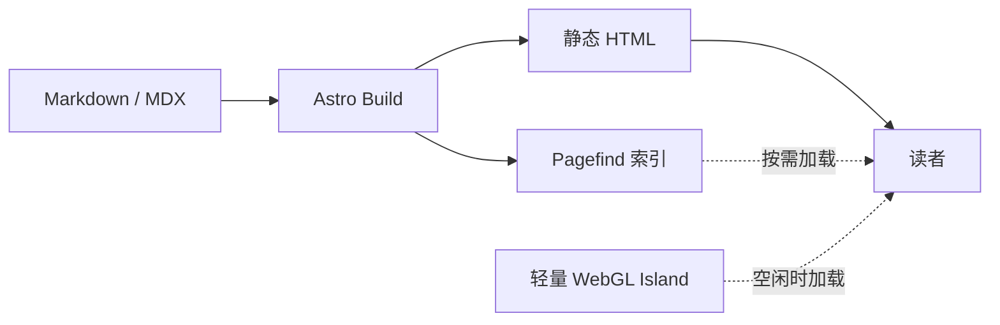

欢迎来到 **LFW Space**。

这是一个从零开始、准备长期维护的个人技术博客。它既用来发布相对完整的文章，也会收纳项目复盘、学习笔记和仍在生长的想法。比起追求更新频率，我更希望它具备三个特征：**真实、清晰、可持续**。

> [!NOTE]
> 这里的示例文章用于验证博客能力，不代表虚构的工作经历或项目成绩。正式内容会在后续逐步替换。

## 为什么从静态站点开始

博客的核心是内容。Astro 默认把页面在构建阶段渲染成 HTML，浏览器拿到的不是一个等待 JavaScript 接管的空壳，而是可以直接阅读、抓取和缓存的文档。

```ts
import { getCollection } from 'astro:content';

const posts = await getCollection('blog', ({ data }) => !data.draft);
const latest = posts.sort((a, b) => b.data.publishDate.getTime() - a.data.publishDate.getTime());
```

对这个站点来说，不同能力应该运行在不同位置：

| 能力       | 运行位置           | 原因                 |
| ---------- | ------------------ | -------------------- |
| 文章正文   | 构建阶段           | 稳定、快速、适合 SEO |
| 全文搜索   | 浏览器中的静态索引 | 不需要后端           |
| 主题切换   | 浏览器             | 属于设备偏好         |
| Hero WebGL | 浏览器空闲时       | 只是视觉增强         |

## Islands 如何划分边界

页面不会整页水合为 React 应用。只有命令面板和 WebGL 视觉属于 React Island，其余列表、卡片、目录和文章都由 Astro 输出静态 HTML。



这样做不是拒绝 JavaScript，而是让每一段 JavaScript 都能解释自己的必要性。

## 接下来写什么

首批内容会围绕建站过程、前端工程实践和项目复盘展开。分类提供稳定的主题入口，标签则负责建立文章之间更细的连接。

> [!TIP]
> 按下 `Ctrl + K`（macOS 使用 `Cmd + K`）可以打开命令面板；生产构建后也能直接搜索正文。

这篇文章也是一次完整链路测试：标题、目录、表格、代码高亮、Callout、Mermaid、标签、上一篇与下一篇，都会在此页面经过验证。
