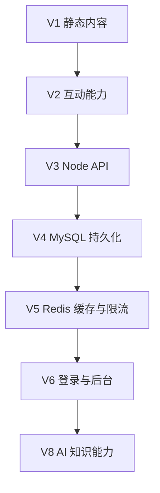

LFW Space 会长期迭代，但不会在第一版就把未来几年可能需要的能力全部装进去。好的扩展性不是提前实现一切，而是让当前边界足够清楚。

## V1：先把阅读做好

V1 只做静态博客最重要的部分：

- 可靠的 Markdown / MDX 内容系统；
- 分类、标签、归档与时间线；
- Pagefind 静态全文搜索；
- Light、Dark、System 三态主题；
- 适度的页面过渡和可降级 WebGL；
- RSS、Sitemap、OpenGraph 与语义化页面。

> [!WARNING]
> V1 不引入数据库、登录、评论后端或管理后台。没有真实需求时，提前搭建这些系统只会增加维护面。

## V2：让内容产生反馈

评论、点赞、浏览量、排行榜和友链都属于内容之外的数据。它们会优先选择成熟托管服务或边缘能力，等需求稳定后再决定是否自建。

## V3 之后：按真实约束演进

未来如果需要动态服务，会把 Astro 前台与 Node API 分离。数据库负责持久事实，Redis 只处理缓存、限流和热点数据，不让缓存成为唯一数据源。

下面是一种可能的演进边界：

## 一个简单的技术判断

当新增能力时，可以用这个不严格但有用的公式提醒自己：

$$
\text{长期价值} = \frac{\text{用户价值} \times \text{可维护性}}{\text{复杂度} + \text{运行成本}}
$$

如果一个功能看起来很酷，却让核心阅读体验变慢、让发布流程变复杂，它就不应该进入当前版本。

## 验收标准

| 维度     | 目标                                 |
| -------- | ------------------------------------ |
| 内容     | 构建时 Schema 校验，无散落数据       |
| 性能     | 核心内容零水合，视觉按需加载         |
| 可访问性 | 键盘可用、焦点清晰、尊重减少动态效果 |
| 维护     | 一个命令创建文章，配置入口集中       |

Roadmap 不是承诺日期，而是帮助每次迭代保持方向感。更完整的版本规划位于仓库的 `docs/ROADMAP.md`。
